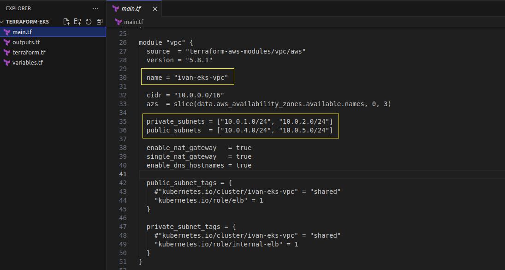
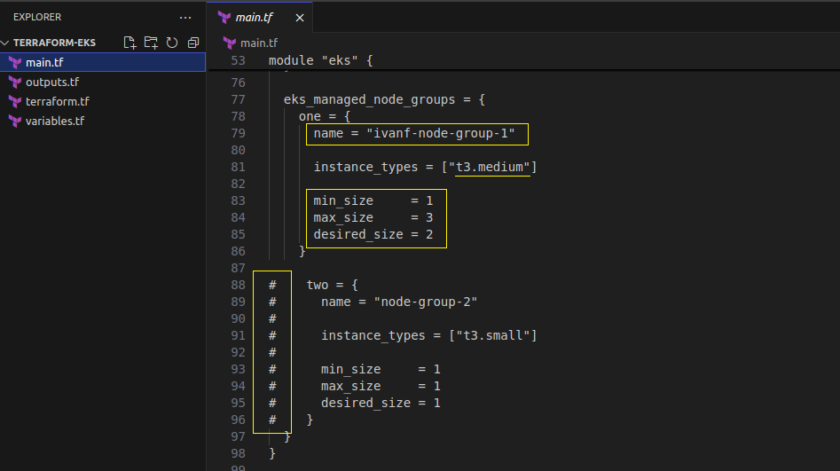

# Final project for IBA devops course 


## CI/CD automation workflow using GitHub Actions, ArgoCD, and Helm charts deployed on K8s cluster

Project task inculde:
Create an EKS cluster with two t3.medium nodes. Deploy any web application to Kubernetes and connect monitoring using Grafana, Prometheus. 
The web application must be accessible via a browser. The application must be deployed via a CI/CD tool. 
Recommended tool for CD in Kubernetes is ArgoCD.

## Implementation steps

 - Prepare AWS EKS using Terraform
 - GitHub actions setting CI part
 - Install ArgoCD in EKS for continious deployment


#### EKS rollout using Terraform

Let's use hashicorp EKS cluster (AWS) example:

```bash
git clone https://github.com/hashicorp-education/learn-terraform-provision-eks-cluster

cd learn-terraform-provision-eks-cluster
```

We will modify vpc name and set only 2 private and public subnets for EKS cluster in main.tf

Only one node group will be used with 2 desired t3.medium instances.






Region also will be changed in variables.tf 


```bash
sudo terrafor init
sudo terraform apply -auto-approve
```


## GitHub actions. OIDC preparation


