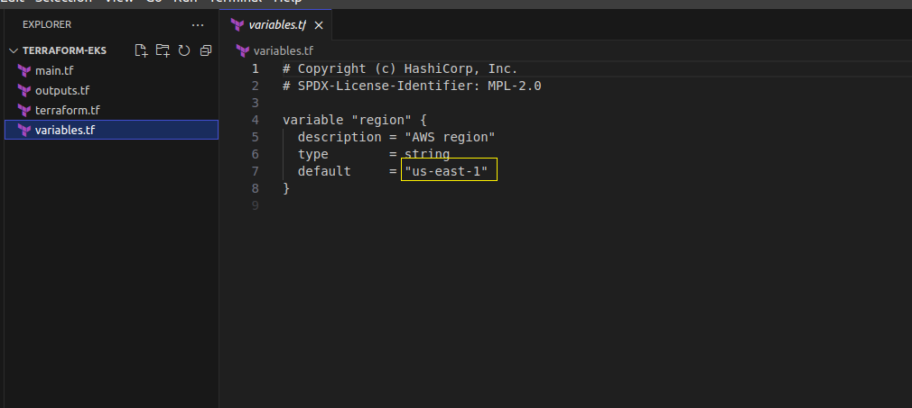

# Final project for IBA devops course 


## CI/CD automation workflow using GitHub Actions, ArgoCD, and Helm charts deployed on K8s cluster

Project task inculde:
Create an EKS cluster with two t3.medium nodes. Deploy any web application to Kubernetes and connect monitoring using Grafana, Prometheus. 
The web application must be accessible via a browser. The application must be deployed via a CI/CD tool. 
Recommended tool for CD in Kubernetes is ArgoCD.

## Implementation steps

 - Prepare AWS EKS using Terraform
 - GitHub actions setting CI part
 - Install ArgoCD in EKS for continious deployment


#### EKS rollout using Terraform

Let's use hashicorp EKS cluster (AWS) example:

```bash
git clone https://github.com/hashicorp-education/learn-terraform-provision-eks-cluster

cd learn-terraform-provision-eks-cluster
```

We will modify vpc name and set only 2 private and public subnets for EKS cluster in main.tf

Only one node group will be used with 2 desired t3.medium instances.


Region also will be changed in variables.tf 




Initialize Terraform workspace and provision rollout of EKS:

```bash
sudo terrafor init
sudo terraform apply -auto-approve
```

Configure kubectl to work with EKS:

```bash
sudo aws eks --region us-east-1 update-kubeconfig     --name ivanf-eks-training
```

## GitHub actions. OIDC preparation


OpenID Connect (OIDC) Identity Provider for GitHub Actions, which help to configure workflows that request temporary, on-demand credentials from any service provider on the internet that supports OIDC authentication.

So using OpenID Connect it's possible to remove the need to have keys stored in GitHub Actions.

Steps:

 - Configure AWS Identity and Access Management (IAM) in our AWS account to believe what the GitHub Actions Identity Provider says.
 - Make an IAM role available to GitHub Actions entities with specific properties.
 - Add an Actions workflow to request and use credentials from AWS.
 


[main.tf.yml](https://github.com/voyager1122/IBA-DEVOPS-PROJECT/blob/main/terraform-openid/main.tf)


We have to configure AWS account ID and github repo which we is planned to have permit access to AWS ECR


```bash
sudo terrafor init
sudo terraform apply -auto-approve
```


